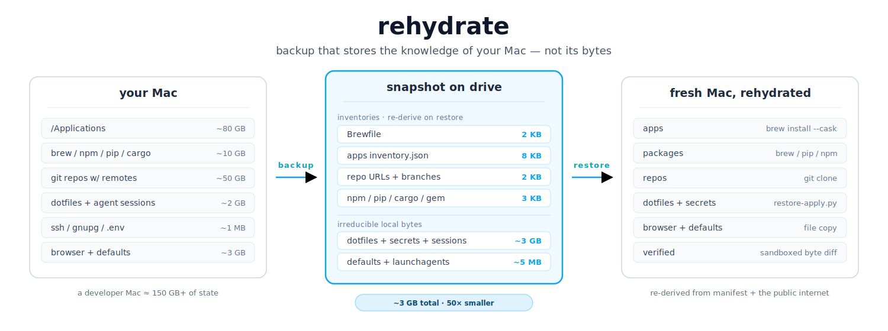

<div align="center">

# rehydrate

**Backup that stores the knowledge of your Mac — not its bytes.**

[](https://github.com/eranshir/rehydrate/actions/workflows/ci.yml) &nbsp; [](LICENSE) &nbsp; [](https://www.anthropic.com/claude-code)



</div>

---

## Backup, rethought for the AI era

Backup tools haven't fundamentally changed since the tape-archive era. They copy bytes — every byte, faithfully, indiscriminately. Time Machine, Carbon Copy Cloner, Backblaze, restic: same mental model. The unstated assumption is that bytes are precious and the machine that restores them is dumb.

Both halves of that assumption are now wrong.

Most of a modern developer Mac is **already on the public internet** — every Homebrew formula, every App Store binary, every cloned repository, every `pip install`. Copying those bytes to a backup drive is not preservation; it is duplication of something that already exists in canonical form somewhere else. And the machine doing the restore is no longer dumb. It can run an LLM that knows what Homebrew is, can re-execute `brew bundle install`, can clone a list of repos by URL, can match a bundle ID to an App Store entry, and can reason about drift when the OS has moved on two major versions.

**rehydrate** is an attempt to design backup from scratch with both of those facts as load-bearing constraints. It is a [Claude Code](https://www.anthropic.com/claude-code) plugin that splits your machine along the line between *what is truly local* and *what is just locally-present-but-publicly-reproducible*. The first half is captured verbatim into a content-addressed object store. The second half is captured as small inventory files (`Brewfile`, `pip-requirements.txt`, `repos.json`, `apps inventory.json`) that a future LLM replays on a fresh machine. Every backup is automatically restored into a sandbox and byte-diffed against the source before the snapshot is reported as successful.

## Why rehydrate

- **Tiny on disk.** All 40 apps on this Mac fit in **8 KB** of inventory. Every package manager combined: **&lt;5 KB**. 31 cloned git repos: a **2 KB** list of remote URLs.
- **Restorable years from now.** The snapshot ships with a hybrid `manifest.json` (machine-readable inventory) plus a `RESTORE-GUIDE.md` (narrative rationale for the future LLM). Designed to survive across model versions, OS upgrades, and arch changes.
- **Verified end-to-end, every time.** After each backup, `verify-sandbox.py` actually drives the full `restore-plan` → `restore-apply` flow into a throwaway temp directory and compares every byte against the manifest. If the round-trip fails, the snapshot is flagged before you trust it.

## Quick start

**Install** (current method — clone and register as a local plugin; see [INSTALL.md](INSTALL.md)):

```bash
git clone https://github.com/eranshir/rehydrate.git ~/.claude/plugins/rehydrate
# in Claude Code:
# /plugin install --plugin-dir ~/.claude/plugins/rehydrate
```

Once published to the Claude Code marketplace, the install becomes a one-liner: `/plugin install rehydrate`.

**Back up this machine:**

```text
/rehydrate:backup
```

The skill asks for a drive path (e.g. `/Volumes/PortableSSD`) and an optional label, then walks every enabled category and writes the snapshot. If a previous snapshot exists on the drive, you'll be prompted to chain to it for incremental dedup.

**Restore a snapshot:**

```text
/rehydrate:restore
```

The skill loads the manifest, probes the target machine, shows a side-by-side drift summary, presents the action plan, runs a dry-run, and requires explicit confirmation at two checkpoints before touching `$HOME`. Restoring to a sandbox tempdir is a single flag away.

## A real backup, by the numbers

Captured live from this developer Mac:

| Category | Bytes on the drive | What it represents |
|---|---:|---|
| `app-inventory` (40 apps) | 8 KB | `/Applications/` bundle metadata, sorted by bundle ID |
| `package-managers` | &lt;5 KB | Brewfile + npm-globals.json + pip-requirements.txt + cargo-installed.txt + gem-list.txt |
| `dev-projects` (31 repos) | 2 KB | Remote URLs, current branch, HEAD SHA — restore is `git clone` |
| `dev-projects` (secrets) | tens of KB | gitignored `.env` / `.p8` / `credentials.json` files (verified gitignored via `git check-ignore`) |
| `local-only-projects` | ~1 GB | 14 projects with no git remote, captured as full file trees (excluding `node_modules` / `.venv` / build dirs) |
| `dotfiles` / `ssh-keys` / `gnupg` | &lt;100 KB | Plain files, modes preserved (0600 for keys) |
| `defaults` / `launchagents` | ~10 KB | macOS preference plists + user launchd agents |
| `browser-profiles` / `app-sessions` | ~3 GB | Chrome/Firefox/etc. (caches excluded); Claude/Codex/Gemini/VS Code/Cursor sessions |

Total snapshot: a few GB. A traditional bit-for-bit clone of the same Mac would be ~300 GB.

## Architecture

```
~/HOME ──walk-* scripts──▶ walk-output JSON ──snapshot.py──▶ drive
                                                             ├── objects/<aa>/<bb>/<sha256>   (content-addressed, deduped)
                                                             └── snapshots/<id>/manifest.json
                                                                                + RESTORE-GUIDE.md
                                                                                + parent.txt

drive ──restore-plan.py──▶ plan JSON ──restore-apply.py──▶ target
                                            └── verify-sandbox.py confirms every byte round-trips
```

Each category in [`categories.yaml`](categories.yaml) is bound to one of five strategies. Each strategy has a dedicated walker that emits a uniform JSON shape, so `snapshot.py` ingests them all the same way:

| Strategy | Walker | What it captures |
|---|---|---|
| `file-list` | [`scripts/walk.py`](scripts/walk.py) | Files matching globs (dotfiles, ssh-keys, gnupg, launchagents, defaults, browser-profiles, app-sessions, custom-content) |
| `package-list` | [`scripts/walk-packages.py`](scripts/walk-packages.py) | `brew bundle dump`, `npm list -g`, `pip freeze`, `cargo install --list`, `gem list`, `~/go/bin` contents |
| `app-list` | [`scripts/walk-apps.py`](scripts/walk-apps.py) | `/Applications/*.app` Info.plist metadata + cask/App-Store/manual source heuristic |
| `repo-list` | [`scripts/walk-repos.py`](scripts/walk-repos.py) | Git remote URLs + branch + HEAD; gitignored secrets verified via `git check-ignore` |
| `full-snapshot` | [`scripts/walk-fullsnap.py`](scripts/walk-fullsnap.py) | Directory trees without git remotes; aggressive default excludes |

Objects in `<drive>/llm-backup/objects/<aa>/<bb>/<sha256>` follow the same two-level fanout as Git's loose object layout. Cross-snapshot dedup is automatic: a file with the same SHA-256 is stored once regardless of which snapshots reference it. `snapshot-gc.py` reclaims objects no longer referenced by any retained snapshot.

## What gets captured (and what doesn't)

iCloud handles **Mail, Notes, Photos, Safari, Keychain, Contacts, Calendar, Reminders, Voice Memos, Messages**, and **App Store apps re-download from your Apple ID** — so rehydrate skips all of those by default. App binaries don't get copied either; they're listed by bundle ID and reinstalled on the target via brew cask or App Store. See [SECURITY.md](SECURITY.md) for what is captured plaintext and the trust model.

## Documentation

- **[INSTALL.md](INSTALL.md)** — three installation paths (marketplace, local clone, skills-only)
- **[USAGE.md](USAGE.md)** — end-to-end walkthrough: backup, restore, snapshot diff, GC, customisation, fresh-Mac migration
- **[SECURITY.md](SECURITY.md)** — trust model, plaintext secrets caveat, no-PII logging guarantee
- **[docs/adr/001-architecture.md](docs/adr/001-architecture.md)** — nine architectural decisions and their rationale

## Project status

**v0.1.0** — initial public release. 396 unit tests; CI green on macOS-14. The architecture is stable; the v2 roadmap focuses on encryption-at-rest, vault-backed secrets, and cross-snapshot diff visualisation.

Contributions and issues welcome at <https://github.com/eranshir/rehydrate/issues>.

## License

[MIT](LICENSE) &copy; Eran Shir
